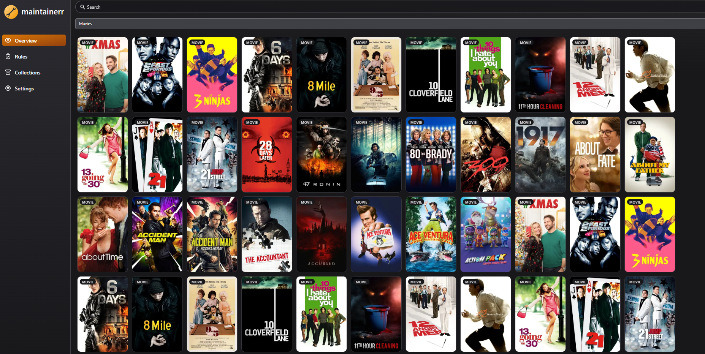
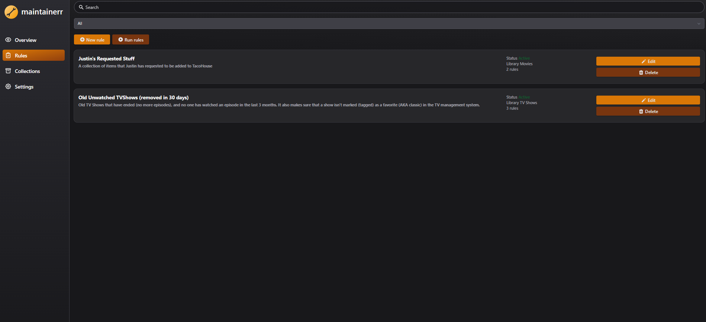
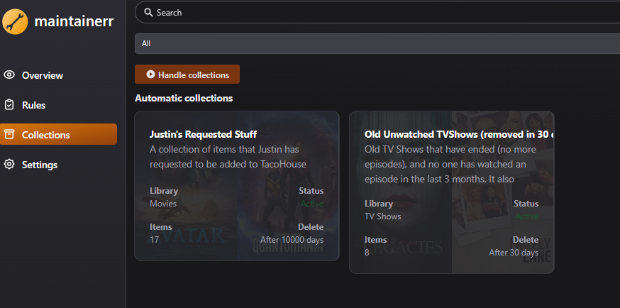
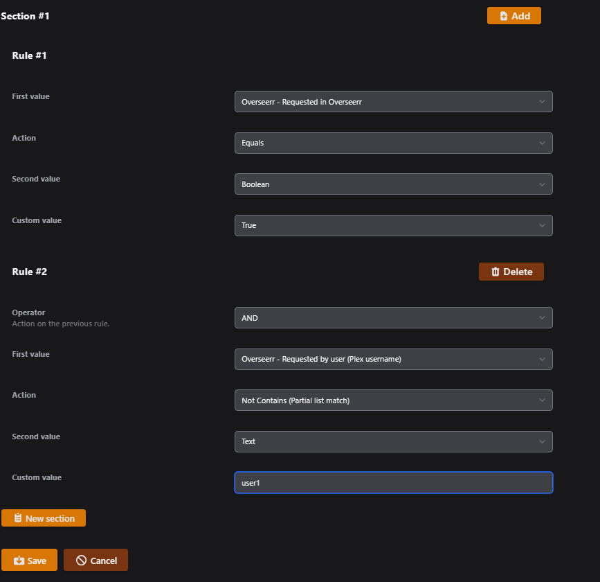

<p align="center">
  
</p>

<p align="center" >
  <a href="https://discord.gg/WP4ZW2QYwk"></a>
  <picture></picture>
  <a href="https://github.com/maintainerr/Maintainerr/releases"></a>
  <picture></picture>
  <picture></picture>
  <a href="https://hub.docker.com/r/jorenn92/maintainerr"></a>
  <picture></picture>
  <picture></picture>
  <picture></picture>
  <a href="https://github.com/sponsors/jorenn92"></a>
  <a href="https://ko-fi.com/maintainerr_app"></a>
  <a href="https://docs.maintainerr.info"></a>
  <picture></picture>
</p>

<b>Maintainerr</b> makes managing your media easy.

- Do you hate being the janitor of your server?
- Do you have a lot of media that never gets watched?
- Do your users constantly request media, and let it sit there afterward never to be touched again?

If you answered yes to any of those questions.. You NEED <b>Maintainerr</b>.
It's a one-stop-shop for handling those outlying shows and movies that take up precious space on your server.

# Features

- Configure rules specific to your needs, based off of several available options from Plex, Overseerr, Jellyseerr, Radarr, Sonarr and Tautulli.
- Manually add media to a collection, in case it's not included after rule execution. (one-off items that don't match a rule set)
- Selectively exclude media from being added to a collection, even if it matches a rule.
- Show a collection, containing rule matched media, on the Plex home screen for a specific duration before deletion. Think "Leaving soon".
- Optionally, use a manual Plex collection, in case you don't want <b>Maintainerr</b> to add & remove Plex collections at will.
- Manage media straight from the collection within Plex. <b>Maintainerr</b> will sync and add or exclude media to/from the internal collection.
- Remove or unmonitor media from \*arr
- Clear requests from Overseerr
- Delete files from disk

<br />
Currently, <b>Maintainerr</b> supports rule parameters from these apps :

- Plex
- Overseerr
- Jellyseerr
- Radarr
- Sonarr
- Tautulli

# Preview






# Installation

Docker images for amd64 & arm64 are available under <b>ghcr.io/maintainerr/maintainerr</b> and [jorenn92/maintainerr](https://hub.docker.com/r/jorenn92/maintainerr). <br />

Data is saved within the container under /opt/data, it is recommended to tie a persistent volume to this location in your docker command/compose file.
Make sure this directory is read/writeable by the user specified in the 'user' instruction. If no 'user' instruction is configured, the volume should be accessible by UID:GID 1000:1000.

For more information, visit the [installation guide](https://docs.maintainerr.info/latest/Installation).

Docker run:

```Yaml
docker run -d \
--name maintainerr \
-e TZ=Europe/Brussels \
-v ./data:/opt/data \
-u 1000:1000 \
-p 6246:6246 \
--restart unless-stopped \
ghcr.io/maintainerr/maintainerr:latest
```

Docker-compose:

```Yaml
version: '3'

services:
    maintainerr:
        image: ghcr.io/maintainerr/maintainerr:latest # or jorenn92/maintainerr:latest
        container_name: maintainerr
        user: 1000:1000
        volumes:
          - type: bind
            source: ./data
            target: /opt/data
        environment:
          - TZ=Europe/Brussels
#      - BASE_PATH=/maintainerr # uncomment if you're serving maintainerr from a subdirectory
#      - UI_HOSTNAME=:: # uncomment if you want to listen on IPv6 instead (default 0.0.0.0)
#      - UI_PORT=6247 # uncomment to change the UI port (default 6246). Useful if you're on a network where the port is already in use
#      - API_PORT=3002 # uncomment to change the API port (default 3001). Useful if you're on a network where the port is already in use
        ports:
          - 6246:6246
        restart: unless-stopped
```

# Documentation

[For more information, please consult the documentation](https://docs.maintainerr.info/)

# Features

[To get an indication of which features are most desired, you can vote for them](https://features.maintainerr.info/?view=most-wanted)

# Credits

Maintainerr is heavily inspired by Overseerr. Some parts of Maintainerr's code are plain copies. Big thanks to the Overseerr team for creating and maintaining such an amazing app!

Please support them at <https://github.com/sct/overseerr>
