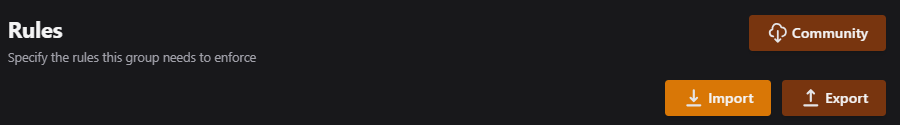

!!! info
    These are not going to solve *every* problem and the suggested solutions might not correct your problem. If you have tried what is laid out here, and it still isn't working as expected. Please reach out on [Discord](https://discord.gg/WP4ZW2QYwk).

## Spinning Circle

Q. I have installed Maintainerr but when I try to view it, all I can see on the page is a spinning circle.

A. This is due to a permissions problem. The container runs by default as user 1000 and the data volume you have set does not have permissions set correctly for that user.

??? example "See The Fix?"
    - check the logs (`docker logs -f maintainerr`) for permissions error
    - run the command `sudo chown -R 1000:1000 <host-directory for /opt/data>`

## Webpage is stuck

Q. When I open the page for the first time I can click on things but nothing is happening.

A. When the Maintainerr page loads up for the very first time, it is supposed to auto-direct to the Plex settings page. Sometimes it doesn't happen and the page looks stuck.

??? example "See The Fix?"
    refresh the page

## TVDBid or TMDBid errors

Q. There are a lot of entries in my logs about Maintainerr being unable to find the TVdbID or the TMDBid. They look similar to this. `[maintainerr] | 01/10/2024 14:20:52  [WARN] [SonarrGetterService] [TVDB] Failed to fetch tvdb id for 'Some TV Show'`

A. Most likely this is a problem with the Plex metadata attached to a particular item. Maintainerr looks to the Plex API for the TMDB or TVDB id to make sure we are matching with the EXACT same item in Sonarr/Radarr/Overseerr/Tautulli.

??? example "See The Fix?"
    Unfortunately at this time there isn't a great fix. The issue comes from inside Plex's metadata agent and what TMDB or TVDB it is assigning or can't find (didn't attach). We are actively looking into a solution but as of right now we don't have one. You could try to **Fix Match** the item in Plex but that isn't guaranteed to solve it.

## Deleting Items

Q. I have set my `Take action after days` to 0, but nothing is being removed.

A. Maintainerrs original design was to mirror Netflix's going away soon category. Maintainerr makes collections that show inside of Plex so that the user can be notified of an upcoming deletion, or Going Away Soon. This is unlikely to change as the intent is not to simply remove data, but provide the user a possible chance to watch something before it is removed, or simply know that it won't be available anymore.

??? example "See The Fix?"
    Simply put, 0 doesn't work. The minimum amount of time that you can set for this action is 1. There is no way to immediately delete items from inside Maintainerr.

## Pre-made Rules

Q. Is there a set of pre-made rules somewhere that I can use as a starting point?

A. There is a `Community` button when you are inside of a new rule. You can pull Community uploaded rules from there. There is a vote feature to show if a rule is good/popular, or if it doesn't work as expected. These rules are not tested or guaranteed to work as advertised. The Community is free to upload as they wish.

??? example "See The Fix?"
    

## Status of Services

Q. When I try to load the Community Rules I get a spinning circle and they never load. The Feature Requests page isn't loading.

A. Some of these services are self-hosted and some are hosted elsewhere. There are downtimes, but we try to minimize them as much as possible.

??? example "See The Fix?"
    There is a website where you can see the status of our services. [Service Monitoring Site](https://status.maintainerr.info)

:material-clock-edit: Last Updated: 10/10/24
