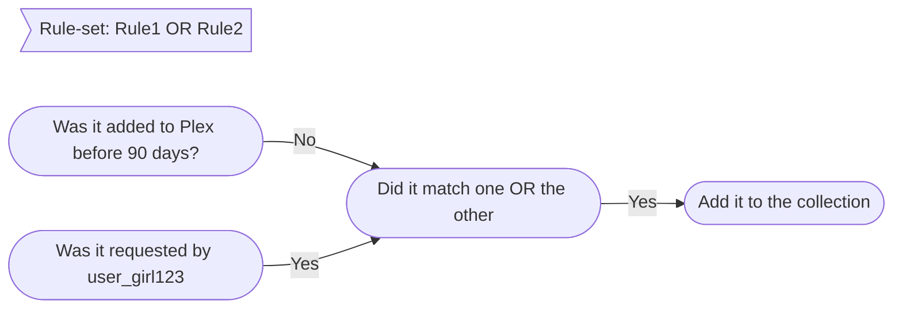

**Let's go a little further into Rules with some simple examples to get you started.**

In episode 1 we went over a super basic outline of rules and sections, operators, and general rule setup. In today's episode we will go over some simple rules examples. You could setup a few AND rules and roll with it, but then you wouldn't be using Maintainerr to its full potential. This episode should give you a good base of rule knowledge to build off of.

<!-- more -->

Let's bring back the Movie from episode 1, that we wanted to add into our new collection.

<p>
</img>
</p>


This movie has the following attributes across Plex, Overseerr, and Radarr:

**Plex** -

| Added | Last Viewed | Times Viewed | Audience Rating |
| -------|-------------|--------------|---------------- |
| 3Nov2023 | 10Jan2024 | 4 | 7.3 |

**Overseerr** -

| Requested by | Requested Date | Times Requested by Anyone|
| ------------| --------------- | ------------- |
| user_girl123 | 2Nov2023 | 4 |

**Radarr** -

| Release Date | Is Monitored | Runtime |
| ------------ | ------------ | ------- |
| 31Oct2023 | True | 114 minutes |

With this information, we have quite a few options that we can use as rule parameters/filters.

# Examples

## Simple Rule

- 1: We can use one rule that states `Plex-Date Added` `before` `amount of days` `60`.
  - This will match in our special tutorial scenario because the day the Movie was added to Plex happened 60 days or more "before" today's date.
- 2: We could use a rule that states `Plex-Times Viewed` `bigger` `number` `3`.
  - This would get added because it has a *Times Viewed* value of 4, which is bigger than 3.
- 3: We could also use a rule that states `Plex-Audience Rating (scale 1-10)` `bigger` `number` `5`.
  - This rule would catch our movie because it's *Audience Rating* is 7.3. Which is bigger than 5.

## Simple AND

- 1: We could add Rule 1 that states `Plex-Date Added` `before` `amount of days` `60`. Rule 2 that states AND `Plex-Times Viewed` `bigger` `number` `5`.
  - This would not catch our movie because it has a *Times Viewed* value of 4 and we need it to match <font color=yellow> (rule 1 AND rule 2)</font>. It does match rule 1 but it does not match rule 2. If another movie in the library was added 60 days ago or more **AND** it had a view count of more than 5. It **WOULD** get added to this rule.
</br>  

**Let's try one more.**

- 2: Rule 1 states `Plex-Times Viewed` `bigger` `number` `3`. Rule 2 states AND `Overseerr-Amount of Requests` `equals` `Plex-Times Viewed`.
  - This rule-set **WOULD** add our movie because it's *Times Viewed* amount is 4 (bigger than 3), **AND** the *Amount of Requests*(4) from Overseerr **EQUALS** the *Times Viewed*(4) amount from Plex. <font color=yellow>(Rule1 AND Rule2)</font>

Those are some fairly simple AND examples, and hopefully it is starting to become obvious what is going on. Within a *section*, and only using AND operators, each item also needs to match the rule before it to be counted as a match and added to the collection.

Another way to look at these examples, is that within a *section*, each rule is making a list. The next rule is checking that list to see if anything ALSO has that value, plus the value of it's own rule.

### Visual Example

 ```mermaid
 graph LR
 title:>Rule-set: Rule1 AND Rule2]
    A([Has it been viewed in Plex more than 3 times?]) -->|Yes|B([AND is it monitored in Radarr?])
    B -->|Yes| C([Add it to the collection])
    B -->|No| D([Don't add to the collection.])
 ```

## Simple OR

We don't have to go too far in-depth with this because of what we have already learned. We will just give a quick example, then a visual.

- 1: We can use one rule that states `Plex-Date Added` `before` `amount of days` `90`.
  - This will not match in our special tutorial scenario because the day the Movie was added to Plex happened only *60* days BEFORE today's date. Not quite *90* days yet.
- 2: Our next rule states OR `Overseerr-Requested by user (Plex or local username)` `Contains (Partial list match)` `text` `user_girl123`.
  - This would match because as we can see, that is who requested the movie.
- 3: This rule-set **WOULD** add our movie because it meets one **OR** the other of our criteria. It was added *60* days ago so it does not meet our criteria of *BEFORE* *90* days, AKA the day it was added has not yet been 90 days *BEFORE* today's date. It did however match the Overseerr requested by user rule. It gets added because we said we wanted <font color=yellow>(Rule 1 OR Rule 2)</font>.
Now let's get a visual.

### Visual Example



Again, I hope this is starting to come together. In our next episode we will be going over the use of sections and when they can be useful. Stay tuned.
