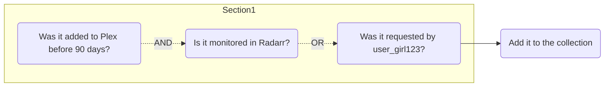
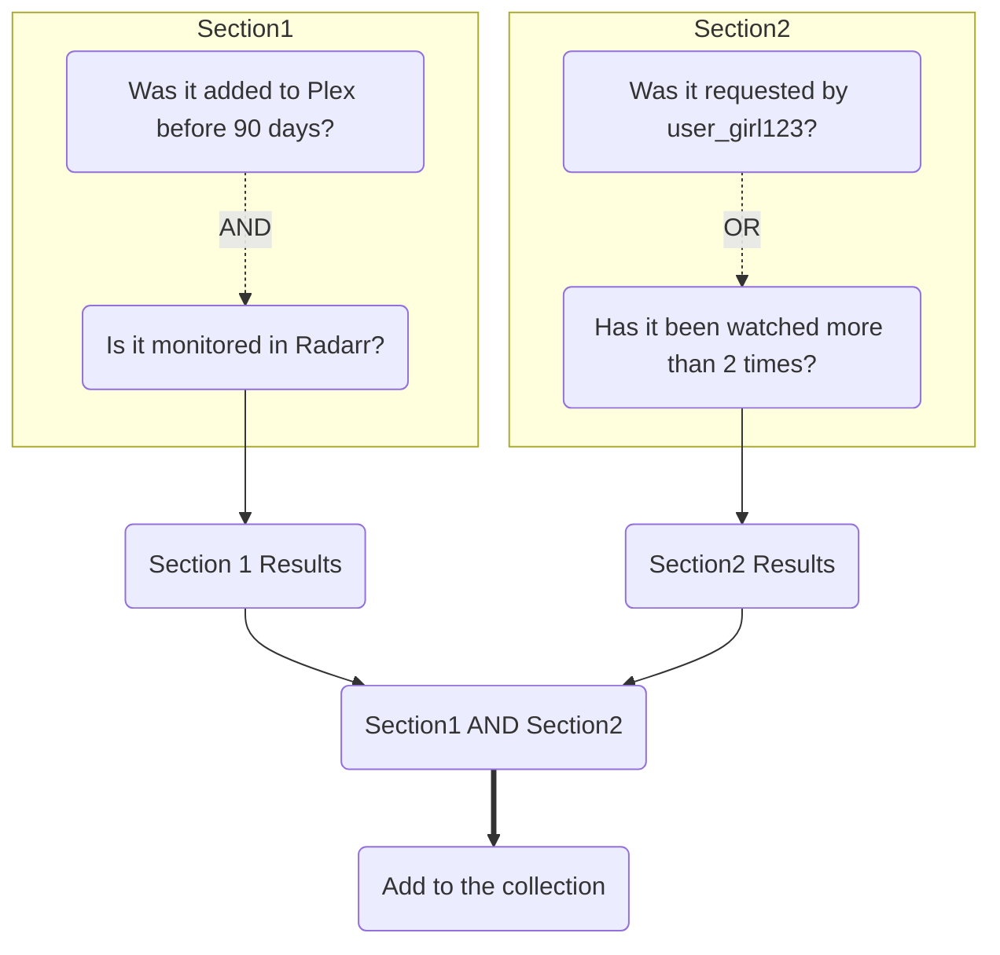
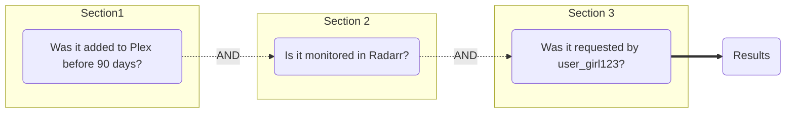

**Why do we even have sections?**

It has been said that another word for sections could be `group`. The reason behind a section is to group a ***section*** of rules together. We need a way to group a few rules together, that we don't want to be a part of the main rule set.
<!-- more -->

## Example 1

This is especially helpful when we need an OR to be ran without it effecting the rest of our rule. In the below example, an item would be included even if it didn't match our other rules (if we ran them all in one section).

In this example it would only have to have been requested by user_girl123 to have matched our rules and be added to the collection. Because we said we wanted `Rule1` AND `Rule2` OR `Rule3`. If `user_girl123` requested this item but it was not added to Plex before 90 days, it would have matched anyways and been added to the collection. ***In this tutorial episode, that isn't what we want.***

## Example 2

Now let's see what would happen in a section example.

In this example we added another rule to the mix. This Section 1 setup would catch items that were `added to Plex before 90 days` AND `monitored in Radarr`, regardless of if they were `requested by user_girl123` or `watched more than 2 times`. The Section 2 setup would catch items that were `requested by user_girl123` OR `watched more than 2 times`.

In order for something to match the overall rule set, it would have to meet our section 1 results AND our section 2 results. It would need to have been `added to Plex before 90 days` AND `monitored in Radarr` AND `watched more than 2 times`. OR, it would have to have been `added to Plex before 90 days` AND `monitored in Radarr` AND `requested by user_girl123`.

## Example 3

Maintainerr runs the rules in a section in order from Rule 1 to Rule X. So when you are making your rules, keep that in mind. This can be useful in a large library where your first rule could potentially match to a lot of items. It is advisable to put this rule at the end of the section. One example could be a rule that is like this:

**Don't do :**

This example is going to have a lot of results for the `zero views` rule (potentially 4k out of a 6k and above Movie library). It would be better in this instance to put the `zero views` criteria at the end. Due to the way Maintainerr runs the rules in order, its "list" from rule 1 could be everything that is `older than 3 years` (potentially only 2k out of the 6k plus movies), then we only have to sift through those 2k items to find the ones that have `zero views`.It could be even further reduced if say 300 of those have the `save` tag. We shaved off 2k movies that need to be checked for `zero views`. These numbers are made up, but this could possibly be the difference of a few hours in a rule execution, or worst case the rule crashes before completion.

**Do:**

## Example 4

This will be our last example/scenario of sections.

This is the same thing as putting all of those rules in one section. `Section 1 results` AND `Section 2 results` AND `Section 3 results`. There is no need to do this and you should keep them all in one section. *(Section 1 (Rule 1 AND Rule 2 AND Rule 3))*.

## Closing

Hopefully you learned a little something today. :) If not, I will try harder next time.

- One more thing I would like to add is how an `OR` works when compared to an `AND`. Again, Maintainerr runs rules in order and makes "list". When `Rule 1` gets looked at, a "list" is created. When Rule 2 is an `AND` to Rule 1, Rule 2 criteria gets matched only to items in the Rule 1 "list". If Rule 2 was an `OR` to Rule 1, the entire library gets looked at again (during Rule 2) to see if anything matches its criteria. This "list" gets added to the Rule 1 list.

Please send me an email at [ydkmlt84@maintainerr.info](mailto:ydkmlt84@maintainerr.info) for suggestions on what to cover in the next episode.
